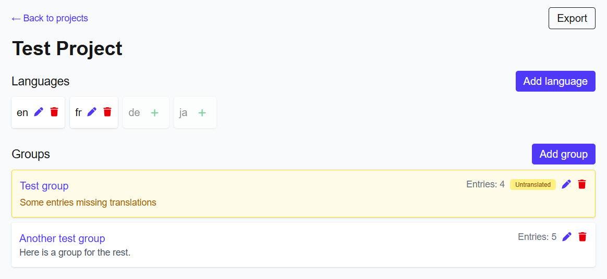
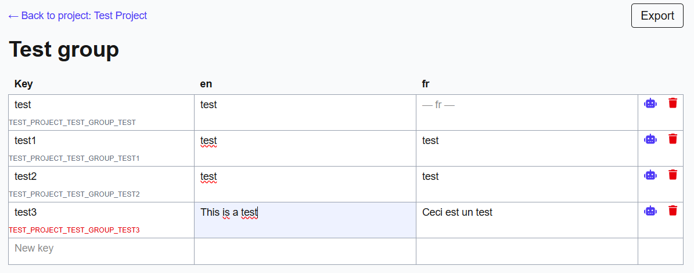

# Godot Translation Tool

A small web tool to help developers translate Godot games. It provides a simple UI and API to manage translatable strings, produce Godot-readable CSV exports, and assist with AI translations.

## Key features

- Translate and manage strings for Godot projects.
- Local-first: run locally for development and testing.
- Docker-ready: get the app hosted within minutes using Docker.
- SQLite database (lightweight, file-based) for local development.
- Export translations to Godot-readable CSV files.
- Automatic export keys and visual highlighting:
  - Each translatable label gets an export key generated automatically.
  - Clicking a key copies it and keeps the key highlighted while clicked.
  - If a label changes, its export key is updated and the highlight is reset so you notice the change.
- AI translation support:
  - Optional: integrate an AI translation service by configuring environment variables (see below).
  - The AI translation respects placeholders like `{placeholder}` and preserves BBCode tags (for example `[b]text[/b]` -> `[b]translated[/b]`).

## Quick start — local

1. Copy example env and set your values:

```bash
cp example.env .env
# then edit .env to set database / AI variables as needed
```

2. Install and run (Node/npm):

```bash
npm install
npm run dev
```

The app expects a SQLite file (the project includes `prisma/dev.db`). Prisma is used for DB access.

## Quick start — Docker

You can host the app within minutes using Docker and the included docker-compose configuration:

```bash
docker-compose up --build -d
```

This will build and run the service in a containerized environment.

## Environment / AI setup

To enable AI translation features, set the following variables in your `.env` file:

- `AI_HOST` — the AI service host URL
- `AI_API_KEY` — API key for the AI service
- `AI_MODEL_ID` — model identifier to use

When AI is configured, the app will attempt to translate text while preserving placeholders (`{placeholder}`) and BBCode tags (`[b]...[/b]`, `[i]...[/i]`, etc.).

## Authentication

For now the app offers a simple Basic Auth protection which can be configured via environment variables. This is intended as a lightweight safety measure for self-hosting and development.

- `BASIC_AUTH_USER` — username for basic auth.
- `BASIC_AUTH_PASS` — password for basic auth.

Add these to your `.env` (or the environment used by Docker) to enable the protection. Note: basic auth is a minimal protection and not a full production-grade auth solution — replace or augment it if you publish the service publicly.

## Exports

- Exported files are CSV files formatted for Godot to import as translation files.
- The app generates export keys automatically to map labels to exportable keys.

## Notes on export-key highlighting

- Keys are highlighted while they are actively clicked/copied so you can clearly see which key you just copied.
- If you edit a label, its key will be regenerated and the highlight will be reset to draw attention to the change.

## Screenshots



_Projects view: list of projects and quick actions._



_Groups view: groups and entries with export keys highlighted._

## Contributing

Small improvements, bug fixes, and documentation updates are welcome. Follow the repo conventions (TypeScript, Next.js App Router, Tailwind, Prisma) and run type checks / linting before opening a PR.

## License

This project does not include a license file; add one if you intend to publish or share the code publicly.
